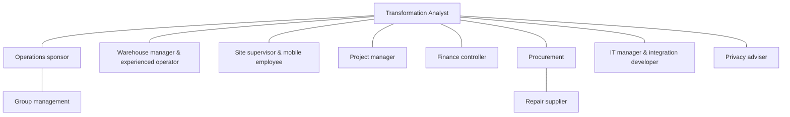

# Stakeholder map

Use a real movement walkthrough with the operator before management interviews. Site users describe poor connectivity; IT tests it rather than interpreting missing submissions as non-compliance. Include supplier and privacy constraints before approving evidence upload. The analyst facilitates conflicts; Operations owns process decisions and Finance owns spending controls.

---
[Repository overview](/README.md) · Fictional portfolio case; proposed design unless explicitly marked as tested prototype.
