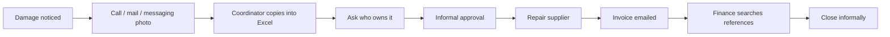

# Damage claims AS-IS

No consistent owner, state, deadline or evidence boundary. Photos may expose people unintentionally. Estimates and invoice actuals are confused; a manager's email lacks versioned approval context. Closure lacks a documented repair outcome.

---
[Repository overview](/README.md) · Fictional portfolio case; proposed design unless explicitly marked as tested prototype.
