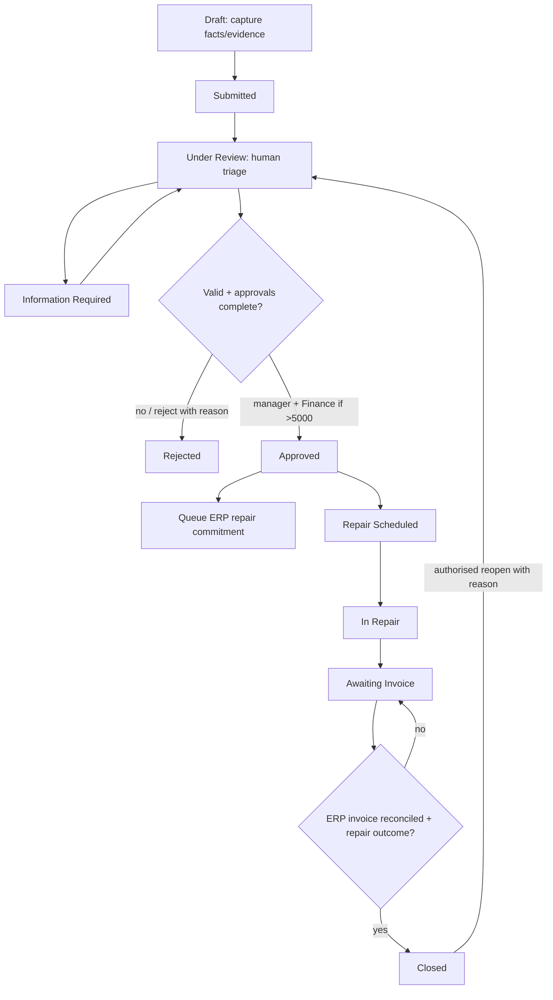

# Damage claims TO-BE

Claims carry photos/documents, description, asset, project/site, reporter, third party if relevant, human liability assessment (Unknown/Own/Third party/Shared/Undetermined), category, severity LOW/MEDIUM/HIGH/CRITICAL, estimate/actual cost, currency EUR, UTC timestamps, owner, comments, decisions and state history.

Submission starts SLA clocks: **triage ≤8 business hours**, **approval ≤16 business hours from review readiness**, and **resolution ≤10 business days from submission**. Calendar: Europe/Brussels, Mon–Fri 08:00–16:00, Belgian public holidays maintained by Operations. Information Required does not pause resolution; blocked cases are labelled for escalation. Critical safety incidents use an immediate phone escalation alongside the claim.

At estimatedCost >€5,000 (strictly greater) Finance approval supplements manager approval. Operations receives notification. Human decisions include amount/version and justification; reporter cannot approve, even with another role. Approved estimate creates repair commitment; invoice posting is ERP Finance's job. Closed requires actual cost/invoice match and outcome. Reopened claim keeps original timeline and new cycle; added spending invalidates previous approvals.

[Full BPMN](../bpmn/README.md) provides pools, lanes, messages, timers and integration error path.

---
[Repository overview](/README.md) · Fictional portfolio case; proposed design unless explicitly marked as tested prototype.
