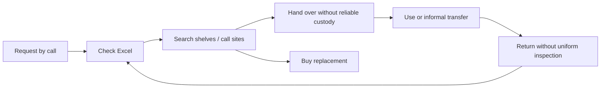

# Inventory AS-IS

Warehouse maintains the sheet but sites can lend directly. Physical location, responsible user and invoice asset reference may disagree. A return on paper is not reconciled systematically. Failure points: missing serials, duplicates, updates after handoff, shared spreadsheets and unsafe return handling. Baseline must sample these failures before introducing QR.

---
[Repository overview](/README.md) · Fictional portfolio case; proposed design unless explicitly marked as tested prototype.
