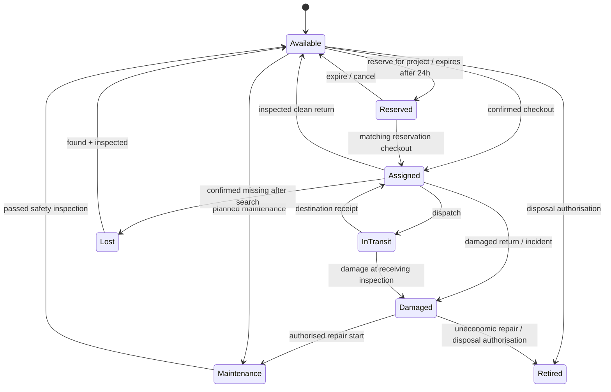

# Inventory TO-BE

Stored status uses **In Transit**. Registration requires immutable AST ID, category, brand/model, optional-but-reviewed serial, ERP capital-asset reference, purchase date/price/current value (ERP-owned for capital assets), warehouse/site, custodian and operational status. QR contains only ID/link. Rental assets hold supplier reference rather than invented book value.

Checkout captures active site and employee. Reserved assets require matching reservation; direct checkout is allowed for Available. Returns require inspection, and damage creates one linked Draft claim. Transfer is two-phase: source retains custody while In Transit; receiver confirms delivery and condition. Maintenance release requires named Warehouse inspection; claim closure does not automatically make an asset available. Loss investigation and financial retirement are separate controlled decisions.

See editable [BPMN models](../bpmn/README.md), [data model](../../04-solution-design/data-model.md) and UAT.

---
[Repository overview](/README.md) · Fictional portfolio case; proposed design unless explicitly marked as tested prototype.
