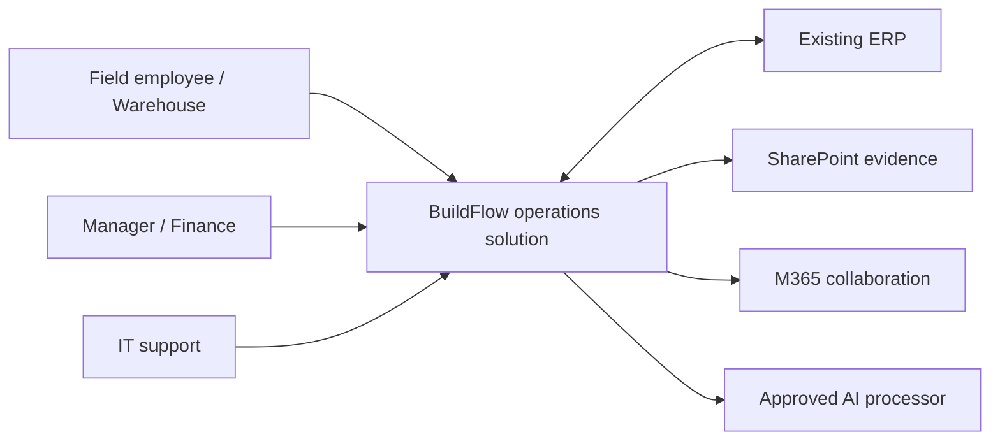
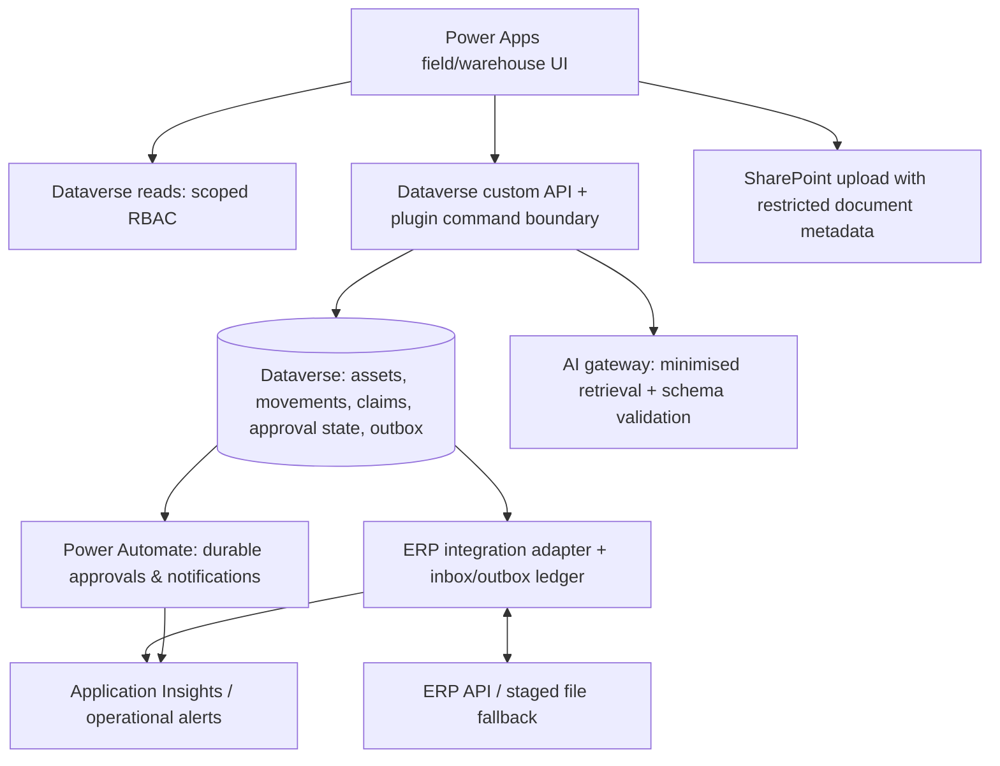

# Architecture — business, application, data and integration

## C4 system context

## Container view

Business capabilities: custody, condition inspection, incident handling, approval control and benefits measurement. Data domains: reference/master, operational transaction, evidence, finance and derived metrics. Integration capabilities: stable business keys, mapping, deduplication, retry and reconciliation.

The command plugin writes state, history and outbox in one transaction. A flow is not a substitute for atomic movement validation. The adapter alone holds ERP credentials; apps cannot call invoice posting directly. SharePoint upload completion must be verified before evidence can satisfy submission. A document reference is not proof of a safe file.

Deploy dev/test/prod separately using versioned solutions and connection references. Licence costs, DLP connector policy, data region and restore features must be verified in tenant procurement/security gates. No production availability is asserted here.

---
[Repository overview](/README.md) · Fictional portfolio case; proposed design unless explicitly marked as tested prototype.
