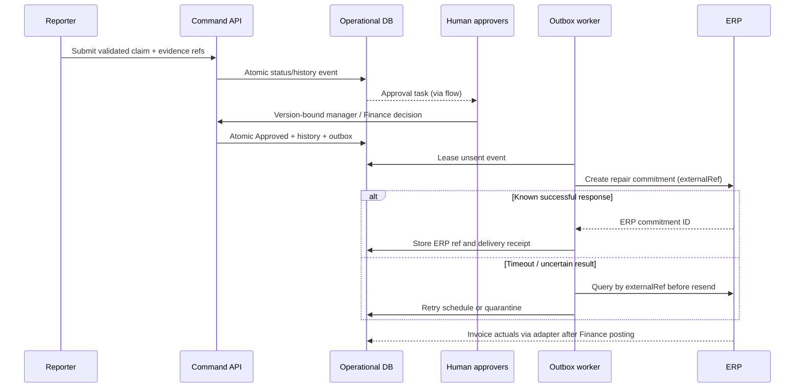

# Data flow and failure boundaries

Data minimisation: QR exposes asset ID only; notifications contain claim ID and authenticated link, not photos. AI receives redacted text and approved source snippets, not raw employee dossiers. Timestamp conversion occurs for display; audit uses UTC. Critical inventory state never depends on ERP response latency.

---
[Repository overview](/README.md) · Fictional portfolio case; proposed design unless explicitly marked as tested prototype.
