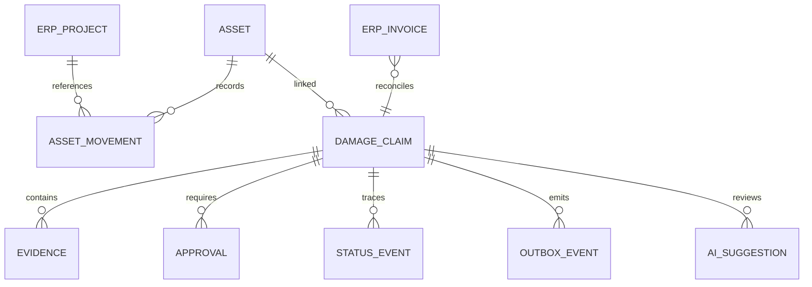

# Data model and system of record

| Entity / key | System of record | Essential fields / constraints |
|---|---|---|
| Project / erpProjectId | ERP | code, name, active, costCentreId, updatedAt |
| Employee / erpEmployeeId | ERP; Entra owns authentication | active, Entra subject mapping; no payroll copied |
| Supplier / erpSupplierId | ERP | name, active; no unnecessary bank details in app |
| Capital asset financial record / erpAssetId | ERP | acquisition date/cost, book value, financial disposal |
| Operational asset / assetId | Dataverse | AST immutable ID, category, brand/model, serial nullable with exception, QR, operational status, locationId, custodianId, version, ERP ref |
| Location / locationId | ERP for sites, app for warehouse bins | type, active, ERP project reference |
| Movement / movementId | Dataverse | assetId, from/to, sender/receiver, action, inspection, UTC, actor, correlation, prior/current version |
| Claim / claimId | Dataverse | asset/site/reporter, description, category, severity, thirdParty, human liability assessment, estimate EUR, actual ERP cost, status, owner, dueAt, version |
| Evidence / evidenceId | SharePoint binary; Dataverse metadata | immutable document ref, MIME, size, hash, scan status, visibility, purpose/retention |
| Approval / approvalId | Dataverse business decision | claimId, revision, approver subject/role, amount, outcome, reason, UTC; unique role+revision |
| Invoice / invoiceId | ERP | invoice ref, cost centre, actual cost, postedAt; app read replica only |
| History / eventId | Dataverse append-only | entity, old/new state, actor, reason, UTC, correlation |
| Outbox / eventId | Dataverse + adapter delivery ledger | schemaVersion, externalRef unique, attempts, lease, nextAt, status, error class |
| AI suggestion / suggestionId | Dataverse | input/source IDs, prompt/model version, output, review state, reviewer, accepted fields |

Currency uses integer euro cents in executable API/storage; docs display euro amounts. No floating-point financial arithmetic. A current-value display does not permit app users to change ERP book value. Status and evidence revision govern approval validity. In-production history retention/access must follow policy, not arbitrary permanent employee tracking.

---
[Repository overview](/README.md) · Fictional portfolio case; proposed design unless explicitly marked as tested prototype.
