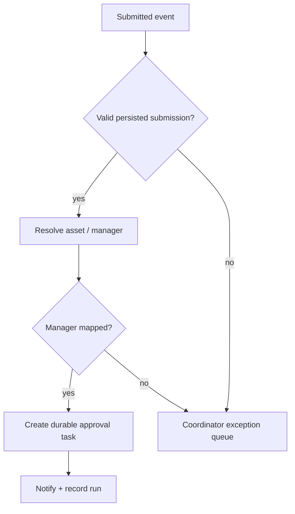

# AUT-01 — Damage claim submitted

**Trigger:** Claim changes Draft → Submitted.

Validate persisted submission; retrieve linked asset and current project-manager mapping. Set Under Review via a version-checked command. Create durable approval task/reference, notify authenticated link and log correlation. Missing manager mapping routes coordinator exception queue; do not auto-assign to Administrator. Trigger filters status plus submission revision; unique claim+revision+flow key prevents duplicate tasks. AI is optional and never delays task creation.

Try/catch/finally scopes use Configure run after for failure and timeout, preserve correlation and send failure to operational queue. Business state is stored in Dataverse; approval orchestration never grants authority on its own.

---
[Repository overview](/README.md) · Fictional portfolio case; proposed design unless explicitly marked as tested prototype.
