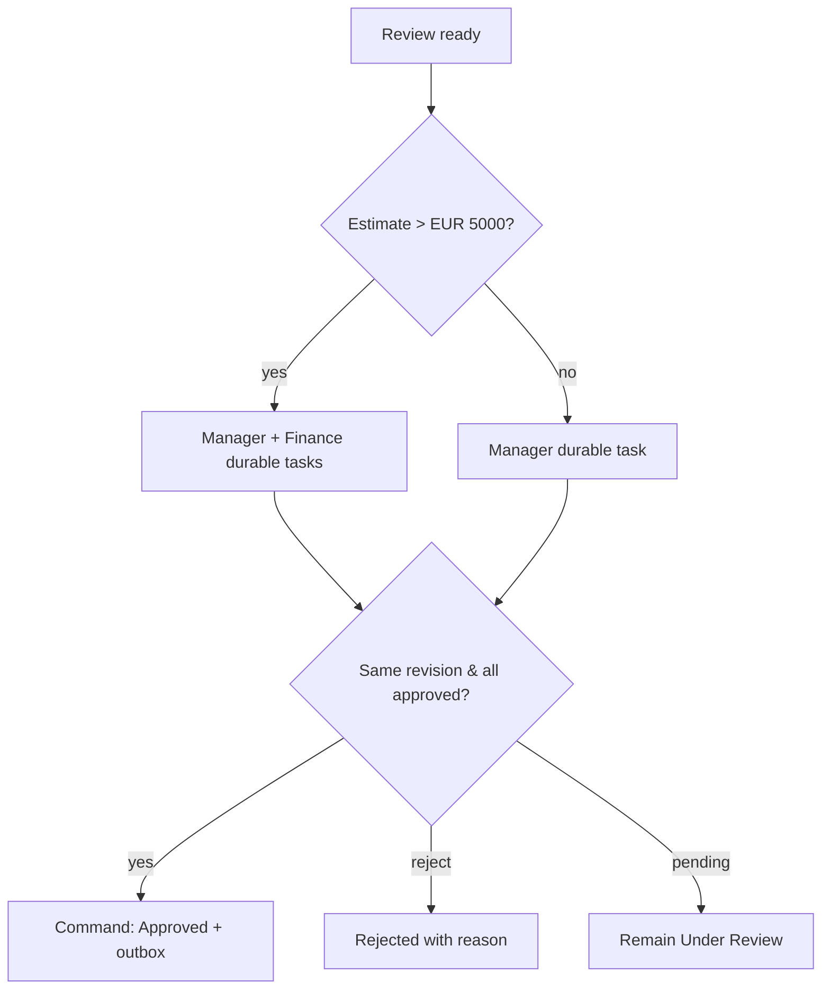

# AUT-02 — High-value damage approval

**Trigger:** Claim ready for approval / estimate revised.

Evaluate integer cents: `estimatedCents > 500000`. For high value require Manager and Finance decisions on the same revision; notify Operations. For exactly €5,000 require Manager only. Decisions are commands with reporter/approver separation. Any material change invalidates approvals. On all required approvals create Approved plus one outbox event atomically. Rejected outcome requires reason; no ERP command emitted.

Try/catch/finally scopes use Configure run after for failure and timeout, preserve correlation and send failure to operational queue. Business state is stored in Dataverse; approval orchestration never grants authority on its own.

---
[Repository overview](/README.md) · Fictional portfolio case; proposed design unless explicitly marked as tested prototype.
