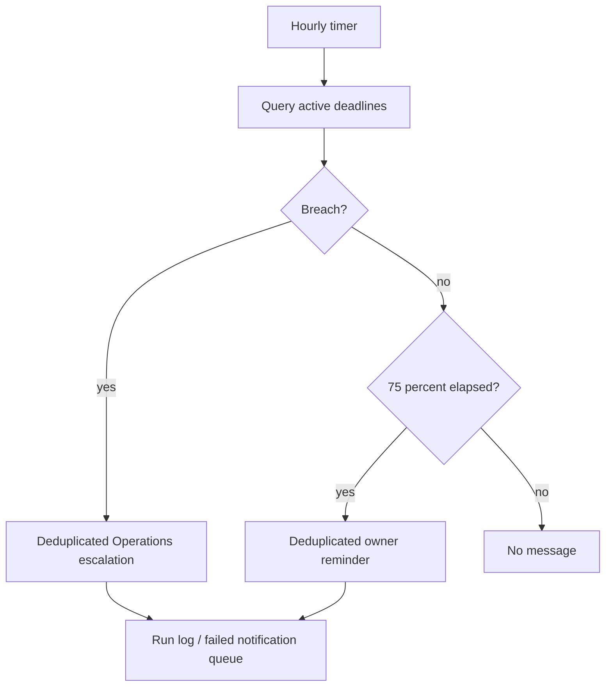

# AUT-03 — Overdue claim

**Trigger:** Hourly scheduled flow.

Query nonterminal claims and business-calendar due dates. At 75% of deadline send one reminder per stage/day/owner. At breach escalate to Operations and retain status. Missing information does not reset clock. Claims on legal hold remain visible with explicit reason. Lease a dedup notification record before send; avoid retry-driven spam. Log failed delivery and alert workflow owner. Delegated approvers need validity dates.

Try/catch/finally scopes use Configure run after for failure and timeout, preserve correlation and send failure to operational queue. Business state is stored in Dataverse; approval orchestration never grants authority on its own.

---
[Repository overview](/README.md) · Fictional portfolio case; proposed design unless explicitly marked as tested prototype.
