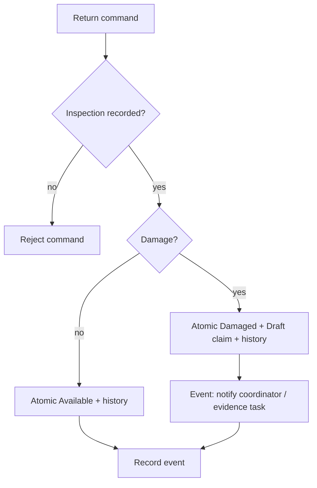

# AUT-04 — Asset return notification

**Trigger:** Atomic return command emits inspected return event.

The transactional command requires inspection and creates a Draft claim on damage. Power Automate consumes the resulting event to notify Warehouse/claim coordinator and prompt evidence completion. Never put separate “update asset” and “create claim” flow actions around a possible crash. Repeated event delivery uses movementId dedup. Clean return updates availability with no damage task. Damaged status blocks checkout regardless of claim rejection.

Try/catch/finally scopes use Configure run after for failure and timeout, preserve correlation and send failure to operational queue. Business state is stored in Dataverse; approval orchestration never grants authority on its own.

---
[Repository overview](/README.md) · Fictional portfolio case; proposed design unless explicitly marked as tested prototype.
