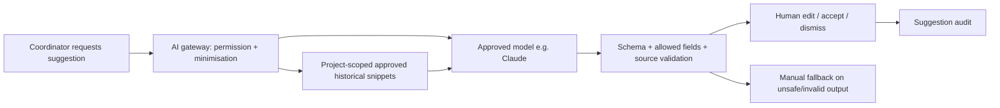

# AI architecture and trust boundary

No model tools can call approval or ERP APIs. Search applies access filters before retrieval. Treat input description/photos and retrieved text as untrusted: instructions inside evidence are data, not authority. Validate source IDs against actual authorised records; no invented citations. Do not store chain of thought; keep structured result, prompt/model version, minimised input hash/reference and review event.

Image input is disabled until a separate multimodal test set and privacy gate pass. Production sends no faces, plates or employee names unnecessarily. Processor terms/data location/log retention must be agreed before live use.

---
[Repository overview](/README.md) · Fictional portfolio case; proposed design unless explicitly marked as tested prototype.
