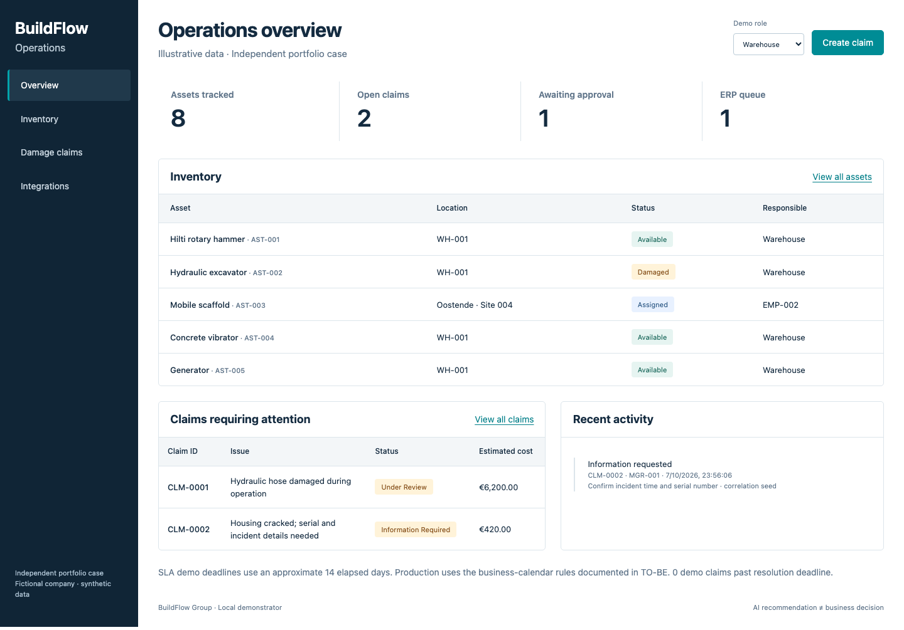
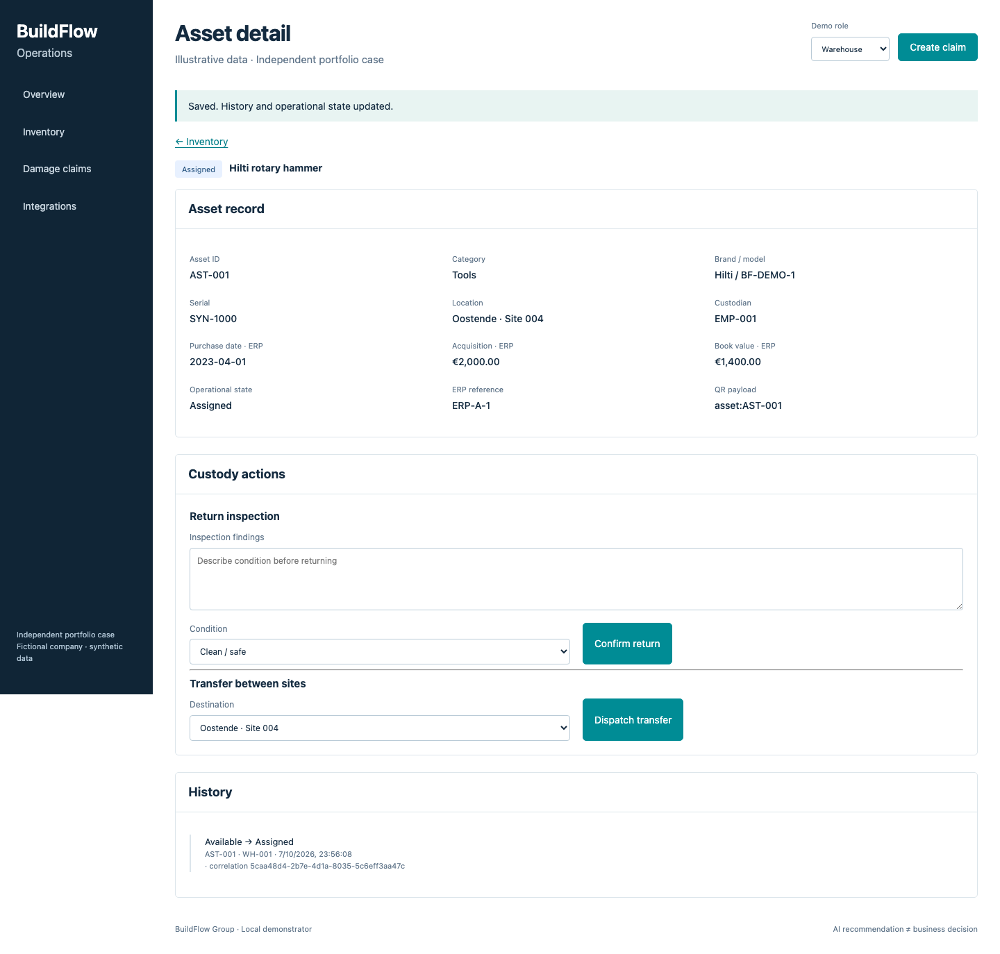
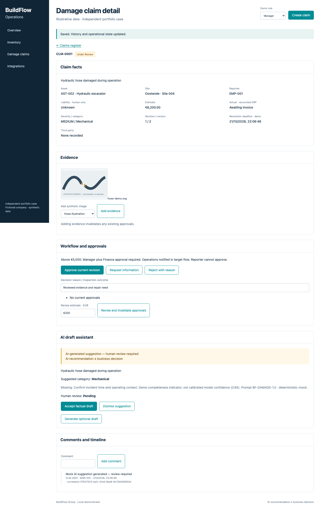
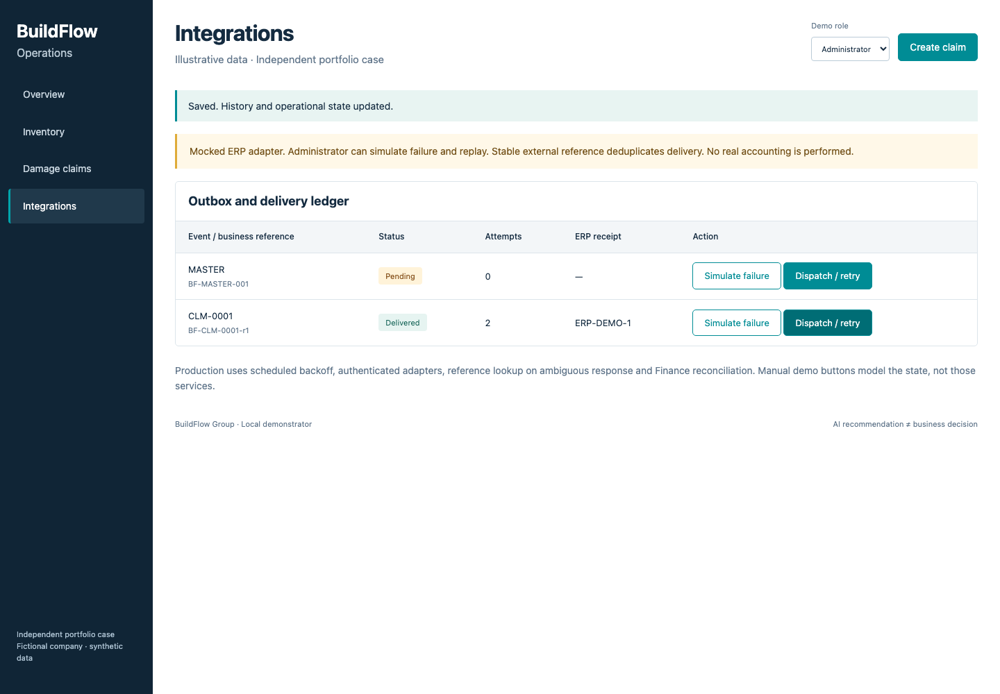
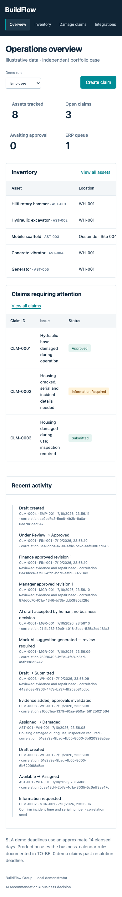
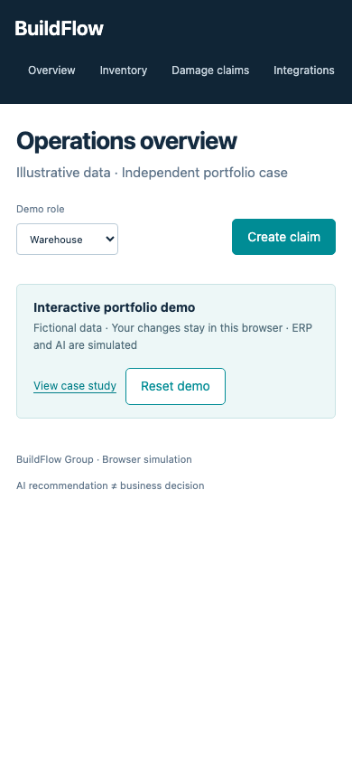

# Prototype evidence

Screenshots are generated from the seeded local prototype by `npm run test:ui`: desktop dashboard, inventory detail, claim/AI review and mobile viewport. They are evidence of the demo, not a deployed enterprise system. Rerun with clean data if initial counts change. [QA record](../../docs/quality-audit.md).

---
[Repository overview](/README.md) · Fictional portfolio case; proposed design unless explicitly marked as tested prototype.

## Desktop overview

## Inventory and claim review

## Integration ledger

## Mobile

## Public GitHub Pages demo

Captured on the published site with a fresh browser context. Each visitor has independent local demo data and can reset the simulation.

