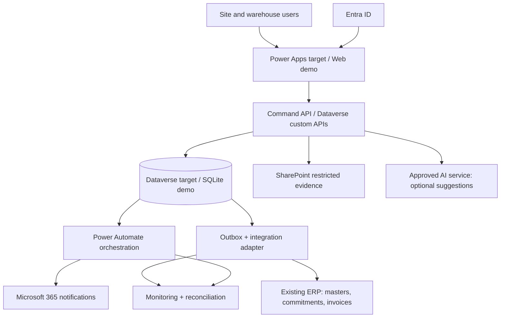

# Architecture at a glance

**Business:** clear asset custody, inspect returns, accountable claims and approval controls.

**Application:** a field/warehouse front end, atomic command boundary, approval orchestration and ERP adapter. Native Dataverse reads are acceptable; all custody writes use custom APIs/plugins so status, history and outbox commit together. Avoid duplicate middleware for ordinary reads.

**Data:** ERP owns financial/master entities. Dataverse owns movements, claims and approval decisions. SharePoint owns restricted binaries; Dataverse holds metadata and references. Reporting consumes curated read models.

**Integration:** asynchronous at-least-once outbound events; stable business reference and inbox deduplication. API timeouts never imply a financial action failed. Reconcile before retrying an uncertain response.

[Detailed architecture](04-solution-design/architecture.md) · [Data model](04-solution-design/data-model.md) · [Decisions](04-solution-design/decision-log.md) · [ERP ownership](05-integrations/erp-integration.md).

---
[Repository overview](/README.md) · Fictional portfolio case; proposed design unless explicitly marked as tested prototype.
