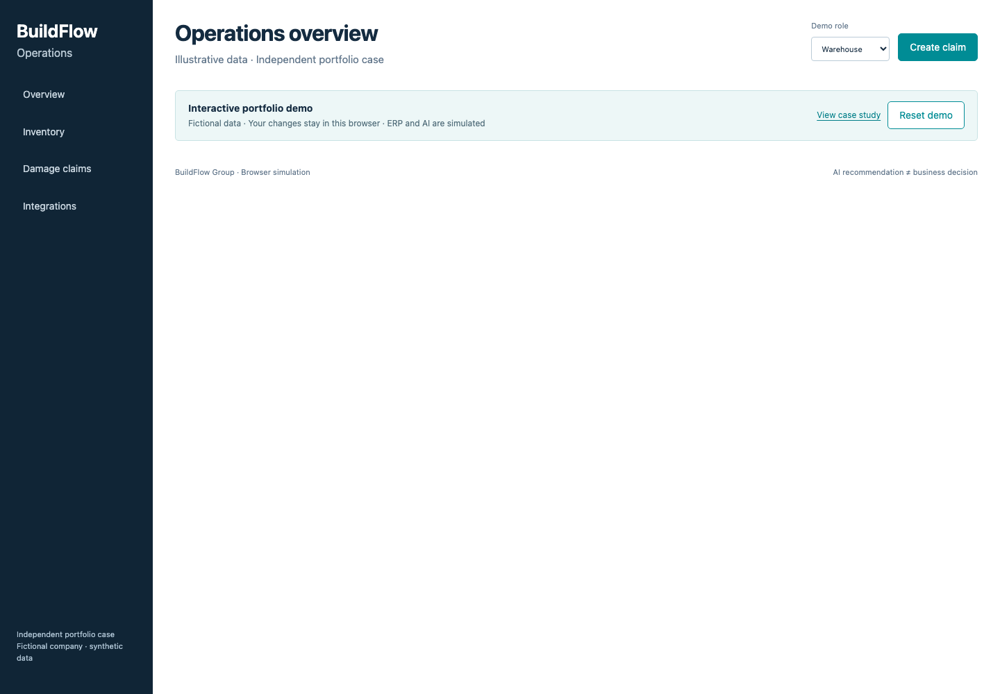

# BuildFlow Digital Transformation Case Study

> An end-to-end digital transformation case demonstrating how business problems are translated into processes, requirements, architecture, integrations, automation, AI and controlled implementation.

**[Open live demo →](https://phlppgdfry.github.io/buildflow-digital-transformation/)** · [Five-minute interview story](14-demo/demo-script-5-minutes.md)

**This is an independent portfolio case study based on a fictional construction company. It does not contain confidential information from any real employer.** Workshop records, approvals, costs and results are simulated. No real deployment, employer engagement or realised savings are claimed.

BuildFlow Group operates a central warehouse, several business units and construction sites in Belgium. Disconnected spreadsheets obscure asset custody; damage reports arrive through calls, email and messaging. This case proposes two connected improvements: **Construction Inventory Transformation** and **Digital Damage Claims**.


## Start here — two minutes

| Audience | Entry point | What to examine |
|---|---|---|
| Recruiter | [Five-minute story](14-demo/demo-script-5-minutes.md) | Evidence of analysis, facilitation and delivery ownership |
| Business manager | [Case study](CASE_STUDY.md) | Operational choices, user resistance and conservative value |
| IT manager | [Architecture](ARCHITECTURE.md) | Ownership, state transitions, integration reliability and security |
| Interview demo | [Executive demo](EXECUTIVE_DEMO.md) | Start the app and follow one asset and one claim |
| Detailed review | [Traceability matrix](02-requirements/requirements-traceability-matrix.md) | Need → requirement → design → test → KPI |

## What I analysed and designed

I modelled stakeholder disagreements, reconstructed AS-IS processes, facilitated a fictional workshop and converted its decisions into prioritised requirements. The TO-BE adds accountable custody and controlled claim handling. ERP ownership is preserved; asynchronous financial processing prevents a warehouse transaction from depending on ERP availability. AI drafts recommendations for a person to review.

The repository contains **design artefacts**, **executable prototype evidence**, and **production readiness gates**. Power Apps, Dataverse, Entra ID, Power Automate and a real ERP are target architecture components, not deployed services. The local app uses Node.js, SQLite and a small browser frontend with mocked ERP and AI. Its simplicity makes the analysis inspectable.

## What this demonstrates

| Job requirement | Evidence in repository |
|---|---|
| Stakeholder analysis | [Map](01-discovery/stakeholder-map.md), [influence matrix](01-discovery/stakeholder-matrix.md) |
| Workshop methodology | [Preparation](01-discovery/workshop-plan.md), [worked notes](01-discovery/workshop-notes-example.md) |
| Requirements elicitation | [Requirements](02-requirements/functional-requirements.md), [traceability](02-requirements/requirements-traceability-matrix.md) |
| BPMN and exception modelling | [Five BPMN 2.0 models](03-processes/bpmn/README.md) with pools, lanes and diagram interchange |
| Architecture and trade-offs | [C4/data overview](04-solution-design/architecture.md), [ADRs](04-solution-design/decision-log.md) |
| APIs | [OpenAPI contract](05-integrations/api-contracts/openapi.json), [API examples](05-integrations/api-contracts/examples.md) |
| ERP understanding | [Ownership and integration](05-integrations/erp-integration.md), [incident runbook](05-integrations/operations-runbook.md) |
| Power Automate | [Flow catalogue](06-automation/automation-catalog.md), [four functional blueprints](06-automation/power-automate/README.md) |
| Appropriate AI | [Opportunity assessment](07-ai/ai-opportunity-assessment.md), [evaluation](07-ai/evaluation.md) |
| End-user guidance | [Change response](11-change-management/adoption-plan.md), [user guide](11-change-management/user-guide.md) |
| Controlled implementation | [UAT](09-testing/uat-scenarios.md), [rollout](10-implementation/rollout-plan.md), [rollback](10-implementation/rollback-plan.md) |
| Business value | [Business case](13-kpis/business-case.md), [measurement definitions](13-kpis/target-kpis.md) |
| Business/IT bridge | [One concern traced end to end](01-discovery/workshop-notes-example.md) |

## Prototype preview



## Try the public demo

Open the [GitHub Pages demo](https://phlppgdfry.github.io/buildflow-digital-transformation/) without installing anything. Your changes and synthetic evidence stay in your browser. Use **Reset demo** to restore the starting data. ERP and AI are simulations; demo roles are not authentication. [Hosting and capability notes](docs/pages-demo.md).

## Run the local API prototype

Requires **Node.js 24** and npm. No cloud credentials, Docker, database server or AI account needed.

```sh
npm ci
npm start
```

Open **http://127.0.0.1:4310**. The server binds only to loopback. The seeded database persists locally; reset it through the documented command in [prototype instructions](08-prototype/README.md). All users and evidence are synthetic. Demo role selection is not authentication.

```sh
npm test             # meaningful API/state/integration checks
npm run check        # links, traceability, OpenAPI and BPMN structural validation
npm run test:ui      # local API frontend workflow
npm run test:pages   # public browser demo, isolation, persistence and reset
npm run build:pages  # build the static deployment artifact
```

## Repository journey

| Stage | Contents |
|---|---|
| [01 Discovery](01-discovery/business-context.md) | Context, stakeholders, workshop, root causes |
| [02 Requirements](02-requirements/business-requirements.md) | MoSCoW, stories, acceptance, NFRs, traceability |
| [03 Processes](03-processes/bpmn/README.md) | AS-IS, TO-BE, exceptions and editable BPMN |
| [04 Solution](04-solution-design/solution-overview.md) | C4, architecture, data, security, ADRs |
| [05 Integrations](05-integrations/erp-integration.md) | OpenAPI, ERP, webhooks, failures and operations |
| [06 Automation](06-automation/automation-catalog.md) | Approval routing, reminders and return inspection |
| [07 AI](07-ai/damage-claim-assistant.md) | Assistive scope, risks, prompt, evaluation fixtures |
| [08 Prototype](08-prototype/README.md) | Runnable local app and explicit capability boundary |
| [09 Testing](09-testing/test-strategy.md) | 24 UAT scenarios and sign-off gates |
| [10 Implementation](10-implementation/implementation-plan.md) | Pilot, migration, cutover, rollback, hypercare |
| [11 Change](11-change-management/adoption-plan.md) | Co-design, communications, champions, training |
| [12 Governance](12-governance/raci.md) | RACI, RAID, risks, decisions and status |
| [13 KPIs](13-kpis/target-kpis.md) | Definitions, baseline, benefits and dashboard |
| [14 Demo](14-demo/demo-script-5-minutes.md) | Interview route, talking points and screenshots |

[Quality audit and limitations](docs/quality-audit.md) · [Technical source notes](docs/sources.md) · [Contribution guidance](CONTRIBUTING.md)
